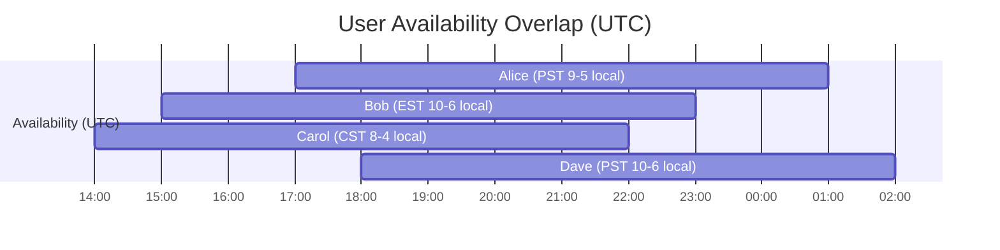

```mermaid
gantt
    title User Availability Overlap (UTC)
    dateFormat  YYYY-MM-DD HH:mm
    axisFormat  %H:%M
    section Availability (UTC)
    Alice (PST 9-5 local)  :a, 2026-04-06 17:00, 8h
    Bob (EST 10-6 local)   :b, 2026-04-06 15:00, 8h
    Carol (CST 8-4 local)  :c, 2026-04-06 14:00, 8h
    Dave (PST 10-6 local)  :d, 2026-04-06 18:00, 8h
```